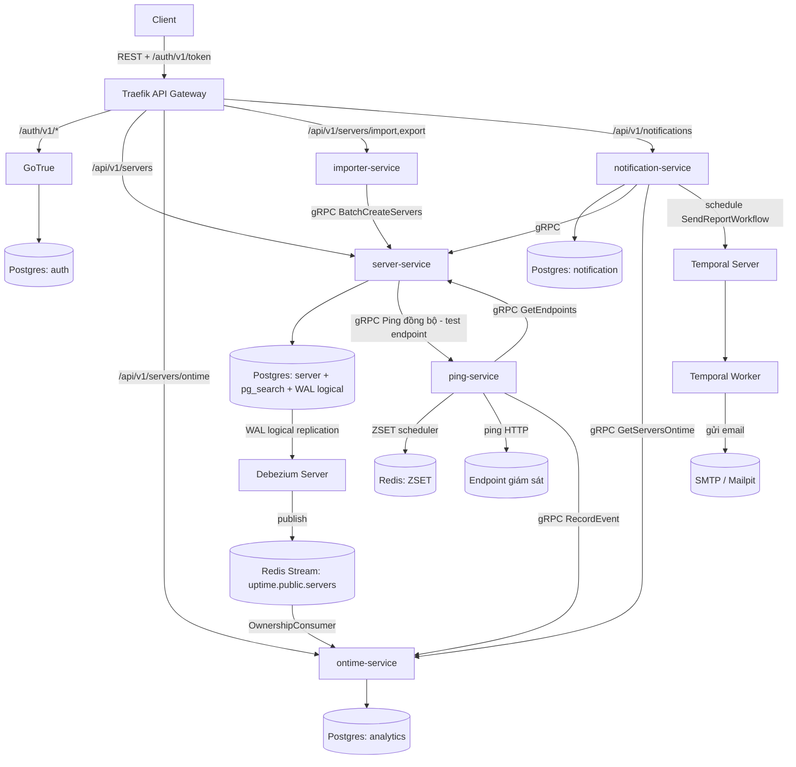
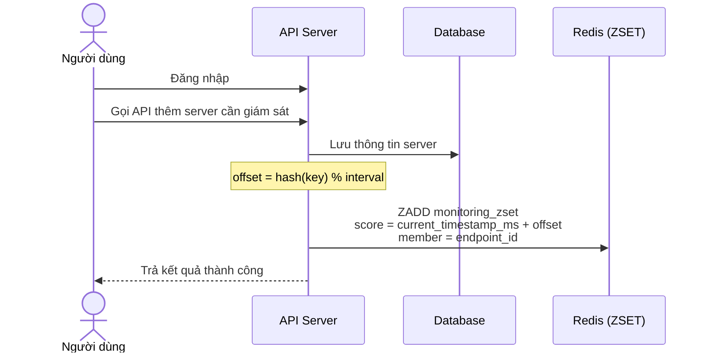
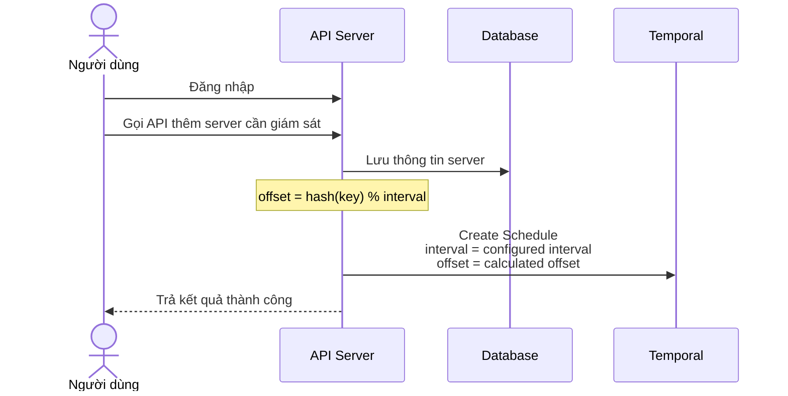
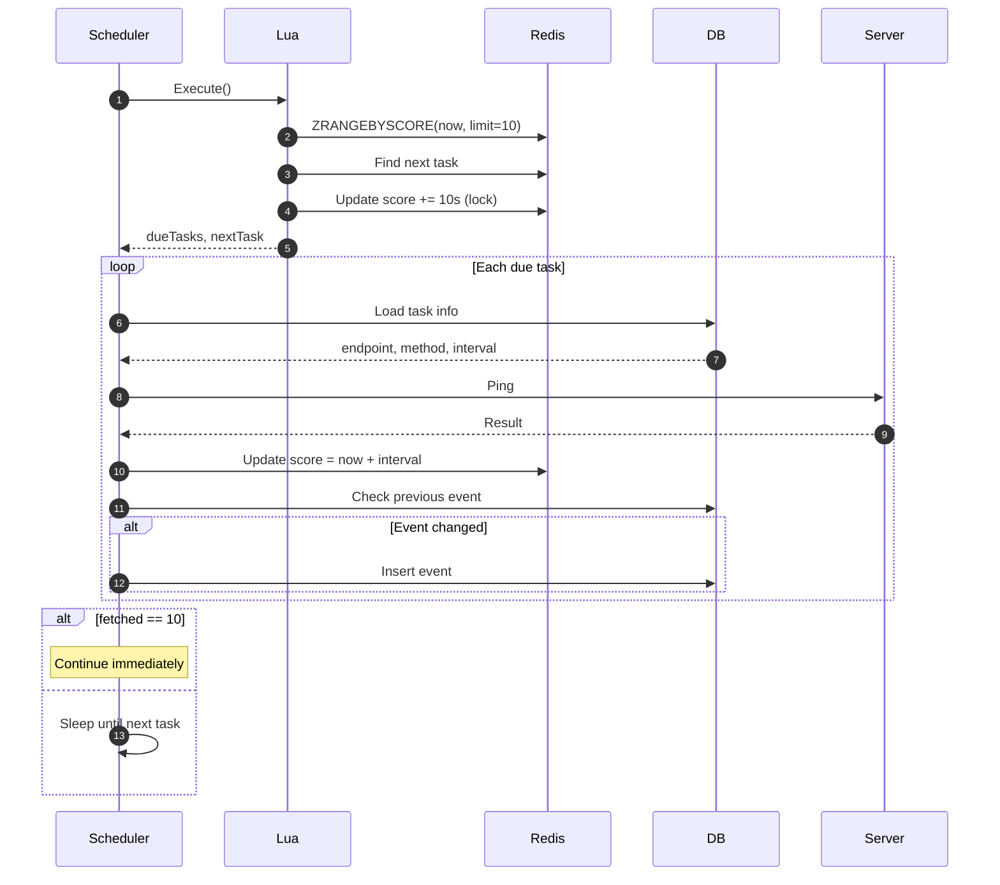
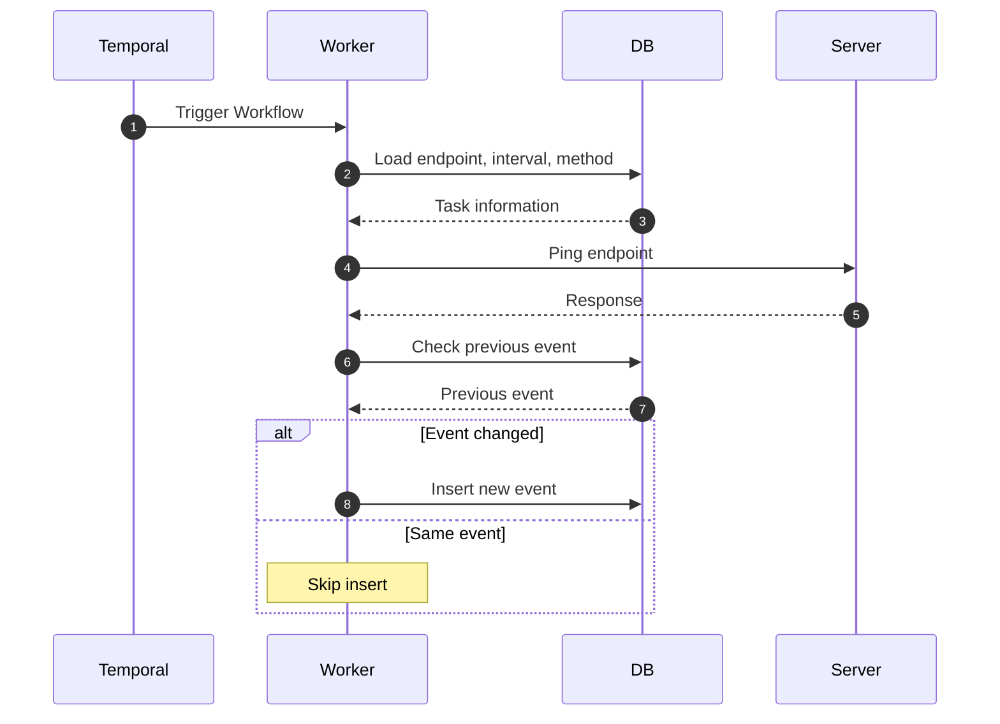
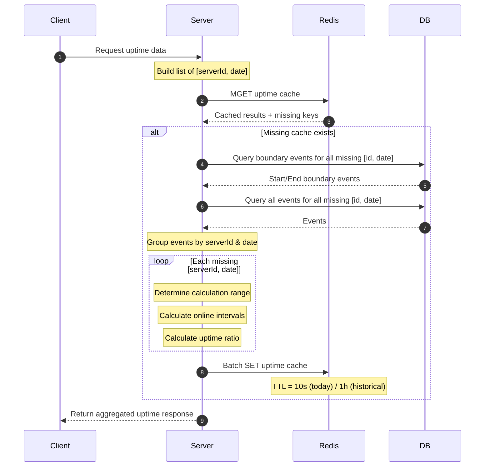
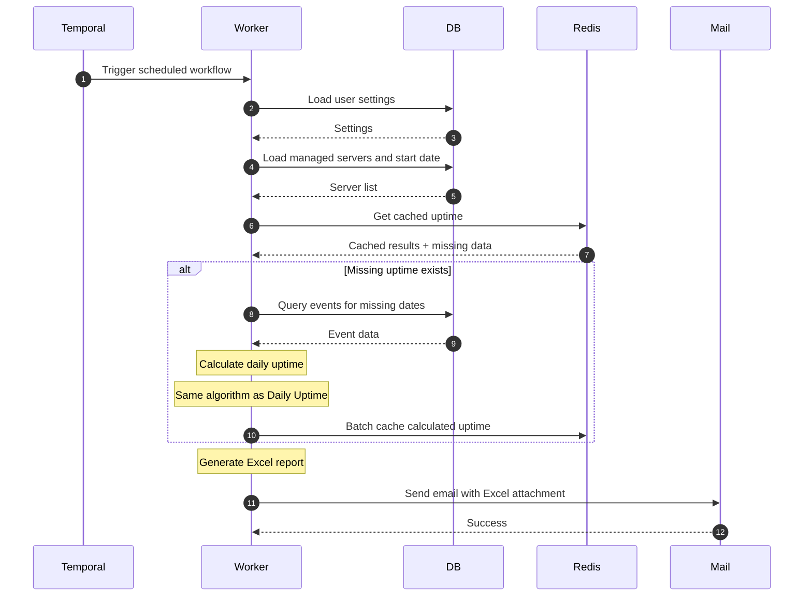
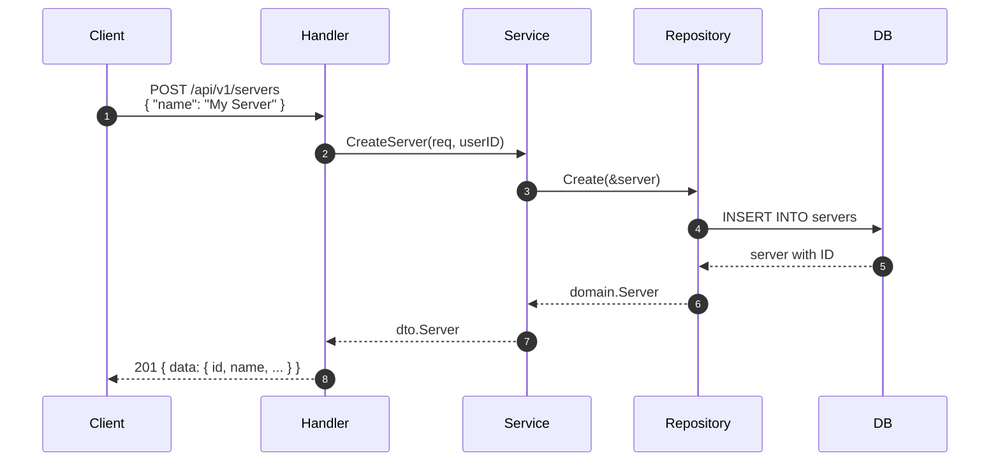
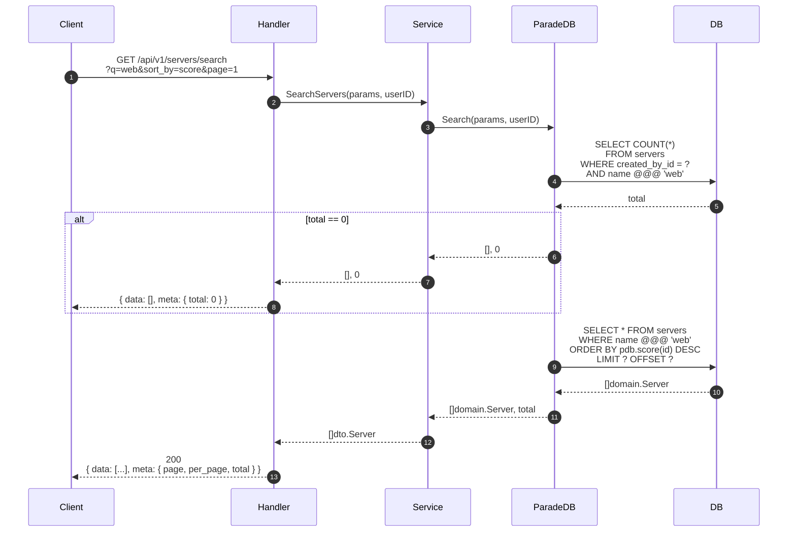

# Báo cáo project checkpoint

# Yêu cầu hệ thống

## Yêu cầu chức năng

* Đăng ký / đăng nhập tài khoản
* Quản lý server (tạo, sửa, xóa, danh sách)
* Cấu hình endpoint cho server (URL, method, interval, timeout, expected code)
* Kiểm tra uptime tự động theo lịch
* Xem tỉ lệ uptime theo ngày (30 ngày gần nhất)
* Tìm kiếm server full-text
* Xuất danh sách server ra Excel
* Nhập khẩu server hàng loạt từ Excel
* Cấu hình thông báo email
* Gửi báo cáo định kỳ qua email

## Yêu cầu phi chức năng

* Có thể định kì kiểm tra được 10000 endpoint với interval 30s
* Điều độ các task tốt, CPU không bị spike
* Code coverange tốt ở các struct liên quan đến business logic
* Không có N+1 xảy ra ở hầu hết các route
* Phần lớn các file đều không quá 200 dòng
* Stateless, đảm bảo khả năng scale sau này
* Code được tổ chức tốt, dễ bảo trì và thay thế các phần sau này
* Có logs cấu trúc, rotation

# Tech stack / Kiến trúc tổng quan

> **Cập nhật:** dự án đã được tách từ một monolith Go duy nhất sang kiến trúc **microservices**, gồm **5 service** độc lập, mỗi service là một Go module riêng (`go.mod` riêng, build/deploy độc lập), giao tiếp với nhau qua **REST (đi qua API Gateway)**, **gRPC (nội bộ, service-to-service)** và **CDC (Change Data Capture) bất đồng bộ qua Debezium + Redis Streams**.

## Danh sách service

| Service | Vai trò | Giao tiếp ra ngoài | Database riêng |
|---|---|---|---|
| **server-service** | CRUD server/endpoint, tìm kiếm full-text, expose dữ liệu server/endpoint cho service khác qua gRPC | REST (`/api/v1/servers/*`) + gRPC server (`ServerService`, `EndpointService` — port `50051`) | `server` |
| **ping-service** | Thực thi việc ping endpoint theo lịch (ZSET), không có REST API, chỉ có gRPC server để test-ping theo yêu cầu | gRPC server (`PingService` — port `50053`); gRPC client gọi sang `server-service` (lấy danh sách endpoint) và `ontime-service` (ghi nhận event) | *(không có, stateless)* |
| **ontime-service** | Ghi nhận event ON/OFF, tính uptime/ontime theo ngày, expose thống kê cho service khác | REST (`/api/v1/servers/ontime/*`) + gRPC server (`EventRecorderService`, `StatusService`, `OntimeService` — port `50052`) | `analytics` |
| **notification-service** | Cấu hình digest email của user, chạy workflow gửi báo cáo định kỳ qua Temporal | REST (`/api/v1/notifications/*`) | `notification` |
| **importer-service** | Import/export danh sách server bằng Excel (gọi sang `server-service` qua gRPC để tạo hàng loạt) | REST (`/api/v1/servers/import`, `/api/v1/servers/export`) | *(không có, stateless)* |

Ngoài 5 service trên, còn có 2 thư viện dùng chung (`common/`):

* **`common/proto`** — định nghĩa toàn bộ hợp đồng gRPC (`.proto`) giữa các service, sinh code bằng `buf generate` (`make gen-proto`).
* **`common/authclient`** — middleware xác thực JWT (OIDC Discovery qua `go-oidc`) dùng chung cho các service có REST API: verify access token do **GoTrue** phát hành, lấy user hiện tại (claim `sub`, dạng UUID) và đưa vào `context` qua `GetUserID(ctx)`.

## Ngôn ngữ & framework nền

* **Go 1.26** — toàn bộ backend viết bằng Go, mỗi service là một module Go độc lập (không dùng `go.work`), cho phép mỗi service có version dependency, lifecycle build/deploy riêng.
* **net/http** — HTTP router; mỗi service tự sinh handler interface từ OpenAPI riêng của mình (không viết route thủ công).
* **ogen** — mỗi service có `api/spec.yaml` (và `api/paths/*.yaml`, `api/schemas/*.yaml`) riêng, sinh types/server interface/client vào `generated/api/`. Có thêm `api/spec.yaml` tổng ở gốc repo để gom tài liệu OpenAPI toàn hệ thống (`api/docs/index.html`).
* **gRPC + Protocol Buffers (buf)** — giao tiếp đồng bộ giữa các service, hợp đồng định nghĩa tập trung ở `common/proto/*/v1/*.proto` (`endpoint`, `event`, `ping`, `server`), sinh code Go dùng chung.
* **samber/do/v2** — Dependency Injection, mỗi service có `internal/app/injector.go` riêng để đăng ký config, repository, service, handler, gRPC client/server.

## Kiến trúc phân lớp trong từng service

Mỗi service (trừ `ping-service`, `importer-service` là stateless) được tổ chức theo cùng một layer chuẩn:

```
handler        → nhận request (HTTP hoặc gRPC), validate DTO, gọi service
service        → business logic của riêng service đó
repository     → truy vấn dữ liệu (GORM / Redis) trong DB của chính service
infrastructure → phần "vật lý": kết nối DB, cache, gRPC client sang service khác, mail, excel...
```

Interface vẫn được định nghĩa ở nơi **sử dụng** (consumer), không phải nơi implement, giúp dễ mock khi test. `CompositeHandler` trong `server-service/internal/handler/composite.go` gộp `ServerHandler` + `EndpointHandler` lại để thoả interface `ServerInterface` do ogen sinh ra — pattern này lặp lại tương tự ở các service khác có nhiều handler con.

## Giao tiếp giữa các service

Ba kênh giao tiếp được dùng, tuỳ theo yêu cầu về độ trễ và độ tin cậy:

1. **REST qua API Gateway (Traefik)** — client bên ngoài gọi vào Traefik, Traefik route theo `PathPrefix` tới đúng service (`/api/v1/servers` → server-service, `/api/v1/servers/ontime` → ontime-service, `/api/v1/servers/import|export` → importer-service, `/api/v1/notifications` → notification-service). Client gọi `/auth/v1/token?grant_type=password` của **GoTrue** (cũng đi qua Traefik) để lấy access token. Các route cần đăng nhập tự verify JWT ở từng service qua middleware dùng chung `common/authclient` (OIDC Discovery, lấy issuer từ config `auth.issuer`) — **không còn forward-auth**, mỗi service tự xác thực request.
2. **gRPC nội bộ** — dùng khi một service cần dữ liệu/tính toán từ service khác với độ trễ thấp, ví dụ: `ping-service` gọi `server-service.EndpointService` để lấy danh sách endpoint cần ping, gọi `ontime-service.EventRecorderService` để ghi nhận kết quả ON/OFF; `importer-service` gọi `server-service.ServerService.BatchCreateServers` khi import Excel; `server-service` gọi `ping-service.PingService` khi người dùng bấm "test endpoint" (ping đồng bộ, không qua lịch); `notification-service` gọi `server-service` và `ontime-service` để lấy danh sách server và số liệu ontime khi build báo cáo digest.
3. **CDC bất đồng bộ (Debezium → Redis Streams)** — `server-service` là nơi duy nhất ghi (write) vào bảng `servers`/`endpoints`, nhưng `ontime-service` cần biết ai sở hữu server nào để tính/lọc ontime theo user mà không phải gọi gRPC đồng bộ liên tục. **Debezium Server** đọc **logical replication** (WAL) trực tiếp từ Postgres của `server-service` (bảng `servers`, `endpoints`), publish thay đổi (insert/update/delete) vào Redis Stream `uptime.public.servers`. `ontime-service` có một consumer (`OwnershipConsumer`, dùng Redis Consumer Group) lắng nghe stream này để đồng bộ bảng `server_owners` cục bộ của mình — đây là cách hai service giữ dữ liệu **eventually consistent** mà không tạo phụ thuộc đồng bộ, không cần gọi ngược từ server-service mỗi khi có thay đổi.

## Cơ sở dữ liệu & lưu trữ — mỗi service một database (database-per-service)

Không còn một Postgres dùng chung cho tất cả — mỗi service có **database riêng**, cùng chạy trên một instance Postgres (`paradedb/paradedb`) khi dev, nhưng tách quyền truy cập bằng user/database riêng (`init.sql` tạo sẵn 3 user/database: `server`, `analytics`, `notification`):

* **`server`** (server-service) — bảng `servers`, `endpoints`. Đây cũng là database duy nhất bật extension **`pg_search`** (ParadeDB, BM25 full-text search) và **`wal_level=logical`** để phục vụ CDC.
* **`analytics`** (ontime-service) — bảng `server_events` (lịch sử ON/OFF) và `server_owners` (bản sao quan hệ server↔user, đồng bộ qua CDC như mô tả ở trên).
* **`notification`** (notification-service) — bảng `notification_configs`.
* `ping-service` và `importer-service` **không có database riêng** — stateless, dữ liệu cần thiết được lấy qua gRPC từ service khác tại thời điểm xử lý.

Các thành phần lưu trữ dùng chung hạ tầng:

* **PgBouncer** — connection pooler đặt trước Postgres (transaction pooling mode) cho các service cần DB, giúp chịu tải tốt hơn khi nhiều goroutine/worker cùng mở kết nối.
* **Redis** — dùng cho nhiều mục đích khác nhau tuỳ service: **ZSET scheduler** cho việc ping (ping-service), transport cho CDC stream (Debezium → ontime-service), cache kết quả tính ontime (ontime-service).

## Cơ chế điều độ ping

Khác với bản monolith trước đây (có 2 cơ chế song song ZSET + Temporal), sau khi tách microservices, việc lập lịch ping **chỉ còn dùng ZSET trên Redis**, chạy hoàn toàn bên trong `ping-service`:

* Vòng lặp `zsetloop` (`ping-service/internal/service/zsetloop.go`) định kỳ dùng Lua script "claim" một batch task đã đến hạn từ ZSET (tối đa 10 entry/lần), lấy thông tin endpoint qua gRPC từ `server-service` (có cache cục bộ ở `scheduler/endpointcache.go`), thực thi ping, rồi cập nhật lại score (thời điểm ping kế tiếp) và gửi kết quả sang `ontime-service` qua gRPC để ghi event.
* Đây là cơ chế nhẹ, tối ưu throughput, đáp ứng yêu cầu \~10.000 endpoint / 30s mà không cần một message broker nặng.
* Để tránh "thundering herd" (nhiều endpoint cùng bị ping tại đúng một thời điểm), thời gian ping đầu tiên được cộng thêm một **offset** tính từ hash của key, chia dư trong khoảng `[0, interval)`.
* **Temporal không còn dùng cho việc ping nữa** — vai trò của Temporal được thu hẹp lại, chỉ còn phục vụ workflow gửi báo cáo định kỳ (xem phần dưới).

## Workflow nền (Temporal) — chỉ còn phục vụ digest email

* **Temporal server** (dev-mode, SQLite file) chạy qua Docker Compose, expose cổng `7233` (gRPC) và `8233` (Web UI), hiện chỉ được `notification-service` sử dụng.
* Một workflow chính: `SendReportWorkflow` (digest) — gọi activity `SendUserDigest` để gửi báo cáo định kỳ qua email; mỗi khi user cấu hình digest, `notification-service` đăng ký một Temporal Schedule tương ứng.
* Vì tần suất thấp (tối đa 1 lần/ngày/user), việc Temporal phải lưu log workflow không còn là gánh nặng như khi dùng cho việc ping tần suất cao.

## Auth & bảo mật

* **GoTrue** (Supabase) làm dịch vụ xác thực thay cho `auth-service` cũ: đăng ký, đăng nhập, phát hành & refresh JWT, quản lý user. Chạy như một service trong compose, lưu user trong Postgres (DB `auth` của chính GoTrue, `gotrue.env` chứa cấu hình & JWT secret).
* Access token là **JWT** do GoTrue phát hành, kèm claim `sub` = user id (UUID) và `aud` (`GOTRUE_JWT_AUD=uptime-monitor`).
* **OIDC Discovery**: mỗi service có REST API tự verify JWT qua `go-oidc` với issuer cấu hình ở `auth.issuer` (`http://gotrue:9999` khi dev); `notification-service` gọi **GoTrue Admin API** (`GET {issuer}/admin/users/{uuid}`) với `service_token` để lấy email user khi build digest.
* **`common/authclient`**: middleware dùng chung — verify token, đọc `sub` (UUID) và đưa vào `context`; handler/service lấy user hiện tại qua `authclient.GetUserID(ctx)`.
* **CORS** cấu hình tập trung tại Traefik (middleware `cors`), áp dụng đồng nhất cho mọi route.

## Các thành phần hỗ trợ khác

* **Viper** — mỗi service quản lý config riêng theo thứ tự ưu tiên `CLI flags > env vars > config.yaml > default`.
* **Zap + lumberjack** — logging có cấu trúc (structured logging) kèm log rotation, dùng chung pattern ở mọi service.
* **wneessen/go-mail** — gửi email digest (notification-service).
* **excelize** — export danh sách server ra Excel và import hàng loạt từ file Excel (importer-service).
* **testify + testcontainers-go** — unit test và integration test; integration test dựng thật Postgres/Redis bằng container ngay trong từng service.
* **golangci-lint** (gofmt, gci, govet, bodyclose, noctx, errcheck, staticcheck, revive...) — bắt buộc chạy trước khi commit, áp dụng cho từng service.

## Đóng gói & triển khai

* **Docker multi-stage build riêng cho từng service**: build bằng `public.ecr.aws/docker/library/golang:1.26` → nén binary bằng `upx` → chạy trên `registry.access.redhat.com/hi/static:latest` (image tối giản, không shell, chạy non-root) để giảm attack surface và kích thước image. Mỗi service có `Dockerfile` riêng.
* **Docker Compose** (`compose.yml`) dựng toàn bộ hạ tầng dev: 5 service, `traefik` (API gateway), `gotrue` (auth), `postgres` (ParadeDB), `pgbouncer`, `redis`, `debezium`, `temporal`, `pgadmin`, `mailpit`.
* **Kubernetes / Helm** (`helm/uptime-monitor/`) — chart triển khai 5 service lên K8s với Traefik làm ingress controller; hạ tầng có state (Postgres, PgBouncer, Redis, Temporal, Mailpit) chạy **ngoài cluster** (một compose riêng, `compose.infra.yml`), cluster trỏ vào qua `ExternalName` Service. Các gRPC server (`server-service:50051`, `ontime-service:50052`) được expose qua **headless Service** (`clusterIP: None`) để client gRPC lấy DNS ổn định theo từng pod thay vì bị load-balance ở tầng cluster-IP. Toàn bộ deployment stateless, không dùng PVC.
* **Air** — hot-reload khi phát triển từng service (`make dev` trong từng thư mục service).
* **openspec/** — lưu các đề xuất thay đổi kiến trúc (proposal, design, tasks, spec) đã/đang thực hiện trong quá trình chuyển sang microservices, ví dụ: tách gRPC cho notification, đếm số server qua gRPC, per-shard goroutine cho scheduler, kiểm tra response body bằng expression, gRPC cho test-endpoint...

## Sơ đồ tổng quan kiến trúc microservices



# CSDL

> Sau khi tách microservices, các bảng dưới đây **không còn nằm chung một database** — mỗi bảng thuộc database riêng của service sở hữu nó (xem mục "database-per-service" ở trên). Mục dưới đây mô tả từng bảng kèm database/service sở hữu.

## 1) `auth` — database của GoTrue (bảng `auth.users`)

Đây là database của GoTrue lưu tài khoản người dùng (`auth.users`, `auth.identities`...). User id có dạng **UUID**, được truyền trong JWT claim `sub` và dùng làm `user_id`/`created_by_id` ở các service khác.

Mỗi user có thể quản lý nhiều server, và có thể có cấu hình báo cáo riêng.

## 2) `servers` — database `server`, sở hữu bởi `server-service`

Đây là bảng đại diện cho một server cần được giám sát.

### Chứa gì?

* `name`: tên server
* `created_by_id`: user nào tạo server này

### Vai trò

* Là “đối tượng chính” mà hệ thống theo dõi
* Mỗi server thường sẽ có một endpoint để ping

### Ý nghĩa

Ví dụ: một user tạo server tên “API production”, “Website staging”, v.v.

## 3) `endpoints` — database `server`, sở hữu bởi `server-service`

Đây là cấu hình để hệ thống biết phải kiểm tra server đó như thế nào.

### Chứa gì?

* `server_id`: endpoint này thuộc server nào
* `url`: URL cần ping
* `monitor_status`: trạng thái giám sát hiện tại
* `interval`: chu kỳ ping
* `timeout`: thời gian chờ ping
* `method`: HTTP method, ví dụ `GET`, `POST`
* `expected_code`: mã HTTP mong đợi, ví dụ `200`

### Vai trò

* Quy định cách kiểm tra uptime
* Là đầu vào cho worker ping

### Ý nghĩa

Một server có thể được kiểm tra bằng endpoint cụ thể, ví dụ:

`GET https://example.com/health` mỗi 30 giây, timeout 10 giây, kỳ vọng `200`.

## 4) `server_events` — database `analytics`, sở hữu bởi `ontime-service`

Đây là bảng lưu lịch sử trạng thái của endpoint/server theo thời gian. Record được ghi vào bảng này thông qua gRPC `EventRecorderService.RecordEvent`, do `ping-service` gọi sang sau mỗi lần ping.

### Chứa gì?

* `endpoint_id`: event này thuộc endpoint nào
* `status`: trạng thái tại thời điểm đó, thường là `ON` hoặc `OFF`
* `time`: thời điểm ghi nhận

### Vai trò

* Là dữ liệu lịch sử để tính uptime/ontime
* Dùng cho thống kê theo ngày, báo cáo, biểu đồ

### Ý nghĩa

Mỗi lần ping xong, hệ thống sẽ ghi một event nếu trạng thái thay đổi hoặc cần lưu lịch sử.

## 5) `server_owners` — database `analytics`, sở hữu bởi `ontime-service` *(bảng mới, sinh ra khi tách microservices)*

Đây là bảng bản sao (replica cục bộ) của quan hệ server ↔ user, để `ontime-service` biết một server thuộc user nào mà không cần gọi gRPC đồng bộ sang `server-service` cho mỗi request.

### Chứa gì?

* `server_id`: id của server (khớp với `servers.id` bên database `server`)
* `user_id`: id user sở hữu server đó
* `deleted_at`: đánh dấu server đã bị xoá (soft delete)

### Vai trò

* Cho phép `ontime-service` lọc/tính ontime theo user mà không phụ thuộc đồng bộ vào `server-service`

### Ý nghĩa

Bảng này **không được ghi trực tiếp** bởi request nào cả — nó được đồng bộ tự động qua CDC: mỗi khi `server-service` insert/update/delete một `server`, Debezium đọc thay đổi từ WAL của Postgres và publish vào Redis Stream, `ontime-service` consume stream đó và cập nhật lại bảng này (`eventually consistent`).

## 6) `notification_configs` — database `notification`, sở hữu bởi `notification-service`

Đây là cấu hình gửi báo cáo định kỳ cho user.

### Chứa gì?

* `user_id`: cấu hình này thuộc user nào
* `active`: có bật gửi báo cáo hay không
* `from_date`: ngày bắt đầu tính báo cáo
* `to_date`: ngày kết thúc
* `digest_time`: giờ gửi báo cáo, ví dụ `08:00`

### Vai trò

* Cho phép user cấu hình daily digest / report
* Worker digest sẽ dùng nó để biết khi nào và gửi cho ai


# Các chức năng

## Chức năng tạo endpoint

### Luồng hoạt động

#### Bên phía API

* Người dùng sau khi đăng nhập sẽ gọi API đến server để thêm server
* Server sau đó sẽ lưu lại thông tin của server cần giám sát tương ứng và thêm 1 task mới vào bộ điều độ, thời gian sau đó sẽ thêm offset được tính theo giá trị hash của key chia dư trong khoảng từ 0 đến interval
* Đối với ZSET của Redis
  * Sẽ thêm 1 entry vào ZSET gồm có ID của endpoint và số điểm là timestamp tính theo ms sau khi cộng với offset
* Đối với Temporal
  * Sẽ thêm 1 schedule tới Temporal với interval và offset





#### Bên phía worker

* Đối với ZSET
  * Sử dụng lua script thực hiện:
    * Tìm kiếm tối đa 10 entry có số score ít hơn thời điểm hiện tại
    * Tìm kiếm 1 task nữa là task sau khoảng thời gian hiện tại
    * Cập nhật score cho cộng thêm 10s để lock các entry được lấy
  * Lấy các dữ liệu như interval, endpoint, method từ redis và cơ sở dữ liệu
  * Thực hiện ping đến các server có score ít hơn
  * Cập nhật lại điểm là thời gian hiện tại + interval
  * Kiểm tra event trước đó xem có giống với event mới không, nếu giống nhau thì không insert
  * Nếu như fetch được 10 entry thì sẽ lập tức lặp để mà fetch thêm score, không thì sẽ sleep đến thời gian task tiếp theo và lặp lại



* Đối với Temporal
  * Temporal sẽ tự động trigger workflow, gọi hàm bên trong worker.
  * Worker sau đó sẽ thực hiện:
    * Lấy các dữ liệu endpoint, interval, method từ cơ sở dữ liệu
    * Thực hiện ping đến server được trigger
    * Insert event như là ZSET



Dự án này ban  đầu dùng Temporal để ping, nhưng Temporal bắt buộc phải lưu trữ log ít nhất một ngày, với số lượng event lớn thì sẽ trở thành gánh nặng cho cơ sở dữ liệu, viên lưu trữ các event cũng không cần thiết. Nên sử dụng ZSET cho việc điều độ các task.

## Chức năng tính thời gian ontime mỗi ngày

### Luồng hoạt động

* Người dùng truy cập vào các trang mà liên quan đến thời gian uptime
* Server sau đó tìm ra các cặp \[id, ngày] và đưa vào cơ sở dữ liệu query như sau:
  * Kiểm tra cache, nếu có dữ liệu id, ngày thì trả về luôn, những ngày không có sẽ được thực hiện tính toán như sau:
    * Với mỗi ngày
      * Tìm ra event đầu ngày là event trước đó gần nhất vào 0h ngày hôm đó
      * Tìm ra event cuối ngày là event trước đó gần nhất vào 23h59p ngày hôm đó
      * Tìm toàn bộ event ngày hôm đó
    * Server sẽ trả về, với mỗi ngày, mỗi server, làm như sau:
      * Chọn thời điểm tính đầu tiên và thời điểm tính cuối cùng
        * Thời điểm đầu tiên là đầu ngày hoặc event đầu tiên
        * Thời điểm cuối cùng là cuối ngày hoặc thời điểm hiện tại nếu ngày cần tính là ngày hôm nay
      * Tìm ra các khoảng thời gian mà server online
      * Tính tỉ lệ uptime bằng tổng các khoảng thời gian online chia cho khoảng thời gian đầu, cuối
    * Lưu lại vào Redis tỉ lệ uptime của server vào ngày hôm đó theo batch với ttl như sau:
      * Nếu là ngày hôm nay thì ttl là 10s
      * Còn lại là 1h
    * Trả về kết quả tìm kiếm, đóng gói và gửi cho client



## Chức năng gửi báo cáo

### Luồng hoạt động

#### Bên phía API

* Người dùng thực hiện lên lịch như mong muốn
* Server sau đó sẽ lưu lại lịch ở cơ sở dữ liệu, đồng thời thêm 1 schedule vào Temporal

#### Bên phía worker

* Sau khi worker được trigger bởi temporal, worker sẽ thực hiện:
  * Xem các thiết đặt của người dùng
  * Tìm các server mà người này quản lý, ngày bắt đầu
  * Tính tỉ lệ ontime giống như chức năng ontime mỗi ngày
  * Đóng gói kết quả vào excel
  * Gửi với địa chỉ mail đã được cấu hình từ trước



Do gửi báo cáo sẽ chỉ hoạt động 1 ngày 1 lần cho nên việc lưu lại log của Temporal sẽ không còn là vấn đề, việc dùng polling của Redis cũng không đạt được độ chính xác cao nếu interval dài và còn gây lãng phí tài nguyên nếu polling với interval thấp.

## Chức năng quản lý server

### Luồng hoạt động

#### Bên phía API

* Người dùng sau khi đăng nhập, có thể thực hiện CRUD server thông qua các API
* Mỗi server có 1 endpoint đi kèm, dữ liệu được phân tách theo user qua `created_by_id`
* Khi tạo server, dữ liệu được đi qua các lớp Handler → Service → Repository → DB
* Khi xoá server, endpoint tương ứng cũng được cleanup (scheduler, Redis cache) trong cùng một transaction



## Chức năng tìm kiếm server

### Luồng hoạt động

#### Bên phía API

* Người dùng gửi từ khoá tìm kiếm lên API search
* ParadeDB (pg\_search extension) thực hiện BM25 full-text search trên cột name
* Đếm total trước, nếu không có kết quả thì trả về luôn
* Nếu có kết quả, query data kèm sắp xếp theo relevance score



# Các chức năng theo yêu cầu

## Dashboard — Server List

Dashboard hiển thị danh sách server (10.000+), trạng thái online/offline, uptime 30 ngày và sparkline chart


## Tạo Server & Cấu hình Endpoint

Form tạo server + Check Method: URL, method, interval, timeout, expected code


## Server Detail & Uptime

Chi tiết server: endpoint config, trạng thái, uptime chart 30 ngày


## Import & Export Excel

Xuất danh sách server ra Excel với filter và sort, hỗ trợ import bulk


## Cấu hình Email Notification

Cấu hình daily digest: from/to date, digest time, nút Send Report Now


